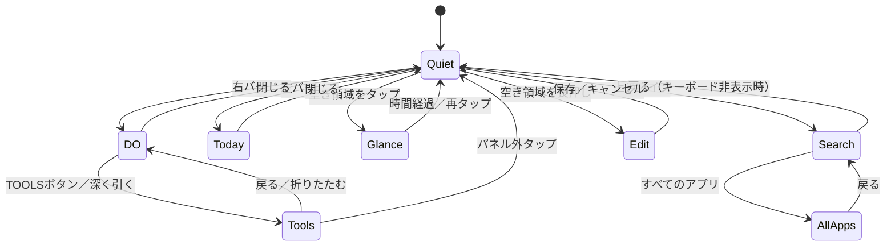

# Quiet Intent Launcher — v1設計

設計日: 2026-09-22。状態: 実装に向けた設計基準。コード・実機検証・配布物はまだない。

## 1. 設計の根拠と対象

> 何もしていない時は推しだけ。何かしたい時だけUIが現れる。アプリではなく行動を選ぶ。

**会話で確認したこと:** Quiet / Reveal / Deepの3層、行動を選ぶDO、TODAY / GLANCE / Universal Search、Panelsを参考にしたバー起点の操作、TOOLSの開き方を設定で選択すること。
特に、エッジ操作は**画面端の表示バーからしか開始できない**。バー以外の端や、画面中央からバーへ移動しても開始しない。

**今回の設計判断:** 以下の初期値、Context Slotsの具体的な規則、技術構成、権限、v1の線引きは「通常の設計判断は任せる」という依頼に基づいて決定した。過去の会話で個別承認済みとは扱わない。元ChatGPT会話の全文を取得できていない点も引き継ぐ。

対象は個人利用のPixelスマートフォン、Android 12（API 31）以上、個人プロファイル、縦画面を基本とする。横画面・大きな文字でも操作不能にしないが、タブレット専用レイアウトは作らない。
ホームアプリとして動作し、別アプリの上にバーを常駐させない。Panelsそのものの再現や連携は要件にしない。

## 2. v1に含めるもの

| 区分 | v1の到達点 |
| --- | --- |
| Quiet | システム壁紙、左右のバー、任意の小時計 |
| DO | 行動の一覧、起動先編集、並べ替え、長押しの派生操作 |
| TOOLS | タップ／深いスワイプの選択、ライト、電卓、QR用アプリ、タイマー、ホームのスクリーンショット |
| TODAY | 日付、曜日、バッテリー。任意で天気と次の予定 |
| GLANCE | 時刻・日付・バッテリー・取得済みの天気を一時表示 |
| Deep | ローカル検索、Web検索への引き渡し、ChatGPTへの共有、全アプリ、設定・編集 |
| Context Slots | 最大2枠。手動固定、曜日・時刻条件で行動を表示 |
| 操作補助 | バーのタップ開閉、読み上げ、文字拡大、動きを減らす設定 |
| 任意のシステム操作 | 下スワイプで通知、ダブルタップで画面OFF。機能ごとに有効化 |

天気・予定・システム操作はv1の設計対象に含めるが、初期状態では無効。有効化しなくても中核機能は成立する。
初期実装は中核から進める。任意機能が未実装の段階はプレビュー版とし、v1完成とは呼ばない。

v1に含めない: 他アプリ上のオーバーレイ、ウィジェットホスト、通知内容の収集、位置情報の常時取得、AIによる意図推論、独自チャット画面、アカウント・クラウド同期、テーマストア、仕事用／プライベートスペースのアプリ一覧。対象外プロファイルがある端末では初期案内で制約を説明し、元のホームへ戻せるようにする。

## 3. 画面と状態

| 層 | 画面 | 表示内容 |
| --- | --- | --- |
| Quiet | 待機 | 壁紙＋バー。時計は任意 |
| Reveal | GLANCE | 軽い情報だけ。操作先のない表示 |
| Reveal | DO / DO＋TOOLS | 行動、Context Slots、道具 |
| Reveal | TODAY | 今日の情報 |
| Deep | 検索 / 全アプリ | 目的やアプリを探す |
| Deep | ホーム編集 / 設定 | 配置・連携・権限を変更 |

- 大きなパネルは一度に1つ。DOとTOOLSは同じ右パネル内の領域であり、重ねた別画面にしない。
- Reveal / Deep中は待機用バーを隠し、別パネルを同時に開かない。GLANCE中だけはバーを維持し、操作するとGLANCEを消して対象パネルを開く。
- 外部アプリの起動が成功したらホーム側の状態をQuietへ戻す。失敗なら元パネルを維持する。
- ホーム操作で戻ってきた場合と画面ロック後の再開はQuiet。検索語や予定名を再表示しない。
- 権限画面・壁紙選択などアプリ自身が開いた設定フローからの復帰は元の設定画面を復元する。ホーム操作が明示された場合はQuietを優先する。
- 構成変更では編集中の下書きと画面内位置を復元する。プロセス終了後は保存済み設定でQuietから開始し、未保存の編集は失われることを編集画面に示す。
- 検索の戻る操作は、キーボード→派生画面→検索→Quietの順。編集の未保存変更は「保存／破棄／編集に戻る」を選べる。

## 4. バーとエッジ操作

### 4.1 表示と当たり判定

左右に縦長の角丸バーを各1本表示する。右はDO、左はTODAYで固定。上下位置は別々に調整できる。
Quietでバーは消さない。壁紙以外の常設表示をこの入口に絞る。バーの隠蔽・透明度0・画面端全体の反応領域は設けない。

| 項目 | 初期値 | 設定範囲 |
| --- | --- | --- |
| 高さ | 使用可能な高さの中央 | システム領域を除いて上下移動 |
| 長さ | 96dp | 48〜160dp |
| 太さ | 12dp | 8〜48dp |
| 不透明度 | 45% | 20〜100% |
| 色 | 白 | 白／黒 |
| 振動 | システム設定に従う | システムに従う／無効 |

**表示バーの矩形と操作領域を一致させる。** 丸角を囲む矩形を判定単位とし、上下・内側に見えない操作領域を足さない。UI部品による最小タッチ領域の自動拡張も、このバーでは適用しない。操作しやすい幅が必要な場合はバー自体を太くする。
設定プレビューでは領域を明示する。編集モードでのみドラッグして位置を変え、通常の長押しで移動しない。
TalkBack利用時は幅48dp・不透明度100%を推奨し、適用はユーザーが選ぶ。幅を勝手に広げたり、透明な領域で操作を拾わない。

バーと操作はホームの描画可能領域に置き、カットアウトとシステム必須ジェスチャー領域を避ける。端末回転・文字倍率変更時には領域内へ収める。
戻る操作の除外要求は表示中のバー領域だけに限定し、バーを隠したら解除する。下端のホーム操作は除外できないため、上スワイプ検索は下端のシステム領域より上から始める。[Android公式: ジェスチャーとの共存](https://developer.android.com/develop/ui/views/touch-and-input/gestures/gesturenav)

### 4.2 ジェスチャーの判定

1. 指を置いた瞬間の座標でバー内かを確定する。後からバーに入っても取得し直さない。
2. 移動がOSのtouch slopを超え、内向きの水平移動が垂直移動の1.5倍以上ならエッジドラッグを開始する。
3. 縦方向が先に確定した場合や外向きに始まった場合はキャンセルする。同じ操作を通知・検索へ振り替えない。
4. ドラッグ中は指に追従。指を離した位置で開閉を確定する。複数指、OSのキャンセル、アプリ中断では閉じる。
5. パネル幅をWとし、内向き移動が0.20W未満なら閉じ、以上なら開く。速度だけでの開閉は行わない。

バーを短くタップしても対応パネルを開ける。ドラッグが難しい場合と読み上げの操作経路として使う。バー上の単タップ・長押し・ダブルタップをホームの操作として解釈しない。

### 4.3 TOOLSの開き方

| モード | 開き方 |
| --- | --- |
| タップで展開（初期値） | DO内のTOOLSボタンを押す |
| 深く引いて展開 | 右バーからのドラッグで深さの閾値に達するとTOOLSまで展開 |

深さの初期閾値は0.75W、設定範囲は0.55〜0.90W。設定は深く引くモードを選択した場合のみ表示する。
閾値を超えるとTOOLS見出しの出現と1回の触覚反応で知らせる。指を戻した場合は閾値より0.08W浅くなった時点でDOへ戻す。最後の展開状態で指を離して確定する。ただし0.20W未満なら全体を閉じる。
TOOLSボタンは両モードで常に残す。開いているDO内の通常スクロールを深いスワイプとして扱わず、バー起点のドラッグだけで深さを判定する。

展開後はDO＋TOOLSを縦にスクロールでき、TOOLS見出しまで表示位置を移す。「DOに戻る」または戻る操作でTOOLSを折りたたむ。
パネル外タップ／見出し部分を外側へ0.20W以上引く操作は右パネル全体を閉じる。リスト行の横操作でパネルを閉じない。

## 5. その他のホーム操作

対象はQuietまたはGLANCEの空き領域。中央タップは説明上の呼び名であり、実際にはバー・時計ボタン等を除く壁紙部分を対象にする。

| 操作 | 結果 | 判定・例外 |
| --- | --- | --- |
| 単タップ | GLANCE表示／再タップで閉じる | 画面OFF有効時のみOSのダブルタップ判定を待つ |
| 上スワイプ | 検索を開き、入力欄へフォーカス | 下端のシステム領域は対象外 |
| 下スワイプ | 通知画面を開く | 無効時は初回だけ有効化案内。以後何もしない |
| 長押し | ホーム編集 | OS標準の長押し時間。移動開始後は発火しない |
| ダブルタップ | 画面OFF（システムロック） | 初期無効。有効時はGLANCEを出さずに実行 |

縦スワイプはtouch slop超過、縦移動が横移動の1.5倍以上、移動距離48dp以上で成立とする。成立までに指を離した短い移動はタップ条件を満たす場合だけタップとして扱う。
バー起点の判定→子UIの操作→空き領域の操作の順に扱い、同じ入力から2つの行動を実行しない。斜め入力は方向が確定するまで保留する。
画面OFF無効時のダブルタップは通常の2回の単タップとなり、GLANCE表示→閉じるだけでロックしない。
空き領域からの横スワイプには機能を割り当てない。

## 6. DOと起動先

初期の行動名は「撮る・話す・聴く・見る・移動する・調べる」。1行に補助アイコンと名前を表示し、名前を主役にする。初期順序はこの順。
各行動の名前、アイコン、順序、起動先、検索用別名を変更できる。不要な行動は非表示にでき、追加は最大12件。名前は空白のみを禁止し、1〜24文字、別名は各1〜32文字・最大8個とする。
同名は許容し、編集と検索では起動先のアプリ名で区別する。

| 操作 | 挙動 |
| --- | --- |
| タップ | 設定した既定の起動先を実行 |
| 長押し | 派生操作と「この行動を編集」を表示 |
| 未設定の行動をタップ | 起動先選択を開く。勝手にストアへ移動しない |
| 起動先が消えた／無効 | 説明と「変更する」を表示し、行動の設定は保持 |

起動先の種類はアプリ、公開されたアプリショートカット、許可したシステム操作、HTTPSリンク。任意のIntent文字列やシェルコマンドの入力は受け付けない。
派生操作は行動ごとに最大6件。たとえば「撮る」に写真・動画・QR・Google Lensを設定できるが、実際に端末で利用可能なものだけを候補に出す。未検証の非公開URIを組み込まない。
アプリ起動には起動可能なActivityを使い、公開ショートカットの取得・起動にはホームの権限と可用性を確認する。[Android公式: LauncherApps](https://developer.android.com/reference/android/content/pm/LauncherApps)

初回の6件は起動先未設定。設定時にインストール済み候補を提示し、ユーザーが選んで保存する。カメラや地図の選択を特定パッケージ名だけで固定しない。
HTTPSリンクは保存時にスキームとホストを検証し、開く前に編集画面でリンク先を確認できる。起動失敗を捕捉して説明し、利用できたときだけ最近の履歴を更新する。

## 7. TOOLS

| 道具 | 動作 | 利用できない場合 |
| --- | --- | --- |
| ライト | 背面の利用可能なフラッシュをON/OFF | 権限説明、カメラ使用中・ライトなしを表示 |
| 電卓 | ユーザーが選んだ電卓アプリを開く | 起動先選択 |
| QR | 選択したスキャナーアプリ／公開ショートカットを開く | 起動先選択。独自の読取画面は作らない |
| タイマー | システムのタイマー一覧を開く | 対応アプリがなければ時計アプリを選択 |
| スクリーンショット | パネルを閉じ、ホームをOSの機能で撮影 | システム操作の有効化案内／失敗を表示 |

道具の順序と表示有無は編集可能。ライト操作ではパネルを開いたまま状態を更新する。状態はOSから再取得し、希望値を成功値として表示しない。
ライト用に常駐サービスは作らない。他アプリ利用やプロセス終了によって消灯し得ることを設定の説明に記載する。[Android公式: CameraManager](https://developer.android.com/reference/android/hardware/camera2/CameraManager#setTorchMode(java.lang.String,%20boolean))

タイマーは即座にカウントを開始しない。時間入力と開始操作は起動先に任せる。写真・動画もカメラアプリを開くところまでとし、無断で撮影しない。[Android公式: Common intents](https://developer.android.com/guide/components/intents-common)
スクリーンショットは右パネルの閉じるアニメーション完了後に1回だけ要求する。端末上でOSが処理するため画像を本アプリで取得・保存しない。別アプリの画面を撮る機能ではない。

## 8. TODAYとGLANCE

### 8.1 TODAY

日付・曜日→天気→次の予定→バッテリーの順。スクロール可能な文字中心の左パネルとし、情報のないブロックは詰める。
日付表記・曜日・12/24時間制は端末設定に従う。バッテリーは整数%と充電状態を示す。残り使用時間は推測しない。

予定はユーザーが選択したカレンダーから読む。繰り返し予定はInstancesで展開された開始・終了時刻を扱う。[Android公式: Calendar provider](https://developer.android.com/identity/providers/calendar-provider)
候補は「現在進行中、または今から24時間以内に開始し、まだ終了していない」予定。キャンセル済み・参加辞退を除外する。
並びは進行中の時刻付き予定→次の時刻付き予定→当日の終日予定とし、各区分で開始時刻、終了時刻、安定したIDの順に1件を選ぶ。明日は「明日」、進行中は「開催中」、終日は「終日」と表示する。
終日の判定はCalendar Providerの終日の日付表現に従い、UTCの午前0時をそのまま端末時刻に変換して日付をずらさない。時刻付きは端末の現地時刻で表示する。
タップで該当予定をカレンダーアプリへ渡す。利用可能な受け手がなければ予定表示を維持して説明する。場所や説明文は取得しない。タイトルなしは「予定」とする。
パネル表示時・前面復帰時・データ変更通知時に更新し、表示中は分境界でも次の予定を再評価する。権限撤回時はメモリ内の予定も破棄する。予定はディスクへ保存しない。

### 8.2 天気

初期無効。設定で「地域を選ぶ」を実行し、地域名検索の結果から1地域を選択する。検索実行時に地域名、天気更新時に選択地域の座標が提供元へ送られることを有効化前に説明する。端末位置権限は要求しない。
提供元は個人利用のv1ではOpen-Meteo。地名検索はGeocoding API、天気はForecast APIの現在の気温・天気コード・昼夜を使い、摂氏の整数と短い天気名で表示する。不明なコードは「天気情報」とし、推測しない。
これは気象モデルの値として扱い、端末位置での実測値とは表示しない。[Forecast API](https://open-meteo.com/en/docs) / [Geocoding API](https://open-meteo.com/en/docs/geocoding-api)

以下の更新・保存時間はアプリ独自の設計値。

- TODAY表示時またはホーム前面復帰時に、前回成功から30分以上なら非同期更新する。GLANCEを開く操作は通信を待たない。
- 同一地域への更新は1件だけ。通信全体の上限10秒、失敗後は5分間自動再試行を抑制。ユーザーの「再試行」も最短30秒間隔とする。
- 成功から60分以内の値は通常表示。60分超〜6時間はTODAYに更新時刻を添え、GLANCEでは省略。6時間超は両方から天気の値を隠す。
- キャッシュがない読み込み中や失敗時は空カードを置かない。設定画面に取得状態と再試行を表示する。
- 地域変更時は旧地域の値を直ちに非表示にし、古いリクエストの応答を新地域のキャッシュへ書かない。
- 同じ起動中の経過時間は単調増加する時計で測る。端末時刻変更・再起動でキャッシュの年齢が判定できない場合は期限切れとして再取得し、未来の取得時刻を新鮮な値として扱わない。
- 無効化すると地域設定と天気キャッシュを削除する旨を操作前に表示し、保存で適用する。
- 夜間・バックグラウンドで定期取得しない。TODAYの天気欄と設定に提供元への帰属表示を設ける。配布・商用化時は提供元の利用条件と帰属要件を再確認する。

### 8.3 GLANCE

初期は画面上部中央の安全領域に時刻・日付を配置し、その下に気温（新鮮なキャッシュのみ）とバッテリーを小さく表示する。予定のタイトルは出さない。
表示位置は上部／中央／下部から選べる。初期表示時間は3秒、設定で2〜10秒または自動消去なし。
再タップ・別パネルを開く・ホーム編集・画面OFFで即座に閉じる。表示中に触っている間は自動消去を止め、離してから再計時する。
TalkBack／スイッチ操作時はユーザーが読み終わる前に消さず、自動消去なしにする。戻る操作でも閉じられる。

## 9. Universal Searchと全アプリ

検索画面は下寄りの入力欄を持つ全画面のDeep。表示時にキーボードを開く。結果はスクロール可能で、入力欄と「すべてのアプリ」「設定」は常に到達可能にする。
空入力では「最近」を最大6件と全アプリ入口を表示。「最近」は本ランチャーから正常に起動したアプリ／行動のみで、OS全体の利用履歴を集めない。
保存は最大20件、同一対象を重複させず新しい順、30日経過で削除。検索文やWebの閲覧履歴は保存しない。記録は初期有効、設定で停止・全消去できる。停止時は保存済み履歴も確認のうえ消す。

### 9.1 ローカル検索

対象は行動名・別名、公開派生操作、インストール済みアプリ名、設定・道具の名称。クエリは前後空白を除き、NFKC正規化・大文字小文字の統一・ひらがな／カタカナの統一をして比較する。
読み仮名の自動生成・翻訳・誤字推測はしない。「写真→撮る」「音楽→聴く」などは編集可能な初期別名で対応する。
複数の語はすべてが名前または別名のどこかに含まれる対象を候補にする。順位はクエリ全体の完全一致→前方一致→部分一致。同順位は行動→道具／設定→アプリ、その中は設定順または日本語の名前順、最後に安定IDで決める。
上位20件を初期表示し、「さらに表示」で20件ずつ増やす。対象IDで重複を除去する。同名アプリはアイコンとパッケージ名の補助表示で区別する。
入力は最大256文字。検索は端末内で行い、入力変更から100msを目安に更新する。古い検索結果が新しいクエリを上書きしないよう、検索世代を照合する。

### 9.2 外部検索・ChatGPT

空白でない入力のときだけ、ローカル結果の後に「Webで検索」「ChatGPTに送る」を表示する。Enterは先頭アプリを勝手に開かず、利用可能なWeb検索を実行する。
Web検索は初期GoogleのHTTPS検索URLへクエリを正しく符号化して渡し、既定のブラウザを使う。ユーザーは設定でGoogle／Bing／DuckDuckGoを選択できる。任意URLテンプレートはv1では扱わない。
ChatGPTはAndroid標準のテキスト共有を使う。対応する受け手があるときだけChatGPTへの送信候補を提示する。未対応なら「共有先を選ぶ」を表示し、ユーザーに選択を任せる。独自API・非公開Deep Link・自動クリップボード書込みは使わない。[Android公式: Common intents](https://developer.android.com/guide/components/intents-common)
結果の受け渡しはユーザーが押したときだけ。送信先での貼付けや最終送信が必要な場合は、そのアプリの操作に従う。ChatGPTへの入力済み画面を必ず開けるとは保証しない。
該当0件でも全アプリ・設定・外部検索への入口を残す。

### 9.3 全アプリ

個人プロファイル内の起動可能なActivityを、カテゴリ別のアイコングリッドで表示する。分類は`ApplicationInfo.category`の自動判定で、グリッドの先頭には「最近」セクションを置く。「最近」は本ランチャーから正常に起動したアプリのローカル履歴のみ（最大6件・新しい順・履歴0件なら非表示）で、OS全体の利用履歴は集めず外部送信もしない。「最近」に出たアプリはカテゴリ内にも残す（重複許可）。
カテゴリは次の固定順とし、空のカテゴリは表示しない: SNS → 仕事・ツール → 音楽・オーディオ → 動画 → 写真・画像 → 地図・ナビ → ニュース → ゲーム → その他。`CATEGORY_UNDEFINED`と未知の値は「その他」にまとめる。
カテゴリ内は日本語ロケールの名前順、同名はパッケージ名・Activity名の順。複数の起動Activityがある場合も対象IDを区別する。
グリッドは端末幅に応じた可変列数（目安80–96dp/adaptive）のアイコンセルで、アイコン＋アプリ名（1〜2行・長い名前は省略）を表示する。最小タップ領域48dp。アイコンが読み込めない場合もアプリ名で識別できる。タップで起動、長押しで「アプリ情報」。アンインストールはアプリ情報側のOS操作に任せる。
追加・削除・更新・有効／無効の変更を反映し、一覧の読み込みが終わらない場合でも設定への入口を操作できる。
個人プロファイル以外を完全に扱えるとは表示しない。隠しアプリ・プライベートスペースを列挙する権限は要求しない。

## 10. Context Slots

DOの通常の行動リストの下、TOOLSボタンの上に最大2件表示する。専用の枠線や空欄は置かず、「いま」の小見出しと行動名を使う。Quietには表示しない。

各スロットは上から評価する規則のリスト（最大8件）と任意の既定行動を持つ。規則は「曜日＋時刻帯＋行動」。曜日指定なしは毎日、時刻指定なしは終日。複数条件はANDとする。
一致した最初の利用可能な行動を表示し、なければ既定行動、いずれもなければスロット自体を消す。起動先未設定・削除済み・無効な行動はスキップする。
時刻帯は開始を含み終了を含まない。同じ開始・終了は入力エラーとし、終日は専用スイッチで指定する。日跨ぎは許容し、たとえば月曜22時〜2時は火曜2時まで月曜の規則として扱う。
端末の現在のタイムゾーンで判定する。夏時間で同じ時刻が再来した場合は同じ条件となり、存在しない時刻を補完しない。

スロット1→2の順。2枠が同じ行動なら後の枠を隠し、次の規則への繰り上げはしない。通常のDO内にも同じ行動がある場合は重複表示を許容し、DOの配置を自動変更しない。
手動固定は規則なし＋既定行動で実現する。初期は2枠とも空。
評価はDOを開いた時点で行い、開いている間は並びを固定して指の下で項目を入れ替えない。ただし起動時は対象の可用性を再確認する。再度開くか設定保存後に更新する。
ラベル例は「朝の音楽」「帰宅ルート」。タップで実行、長押しで条件編集。「表示理由」で一致した規則を確認できる。
イヤホン接続・予定・位置・履歴からの推測は将来拡張とし、v1では対応する権限や常駐処理を追加しない。

## 11. 設定・初回導入

### 11.1 初回導入

1. 壁紙を背景に、バーと上スワイプの短い説明を表示する。説明はいつでも設定から再表示できる。
2. 「ホームに設定」でOSの既定ホーム選択を開く。後で設定も可能。拒否されてもプレビューできるが、ホーム権限が必要なショートカット機能は説明付きで無効にする。
3. 6つの行動に起動先を割り当てる。スキップ可能で、後から未設定項目を押して設定できる。
4. バー位置をプレビューして完了。天気・予定・システム操作の権限をまとめて要求しない。

既定ホームの要求にはRoleManagerのHOMEロールを利用する。[Android公式: RoleManager](https://developer.android.com/reference/android/app/role/RoleManager#ROLE_HOME)

### 11.2 設定の構成

| 画面 | 内容・初期値 |
| --- | --- |
| 見た目 | システム壁紙変更、小時計OFF、時計位置、パネル背景、文字色、動きはOSに従う |
| エッジ操作 | 左右のバー寸法・位置・色・濃さ、TOOLSはタップ、深さ設定、振動 |
| 行動・道具 | DOとTOOLSの順序・表示・起動先・別名・派生操作 |
| 情報 | GLANCE位置と時間、天気OFF、予定OFF、選択カレンダー |
| Context Slots | 2枠の条件と既定行動 |
| 検索 | 最近の記録ON、履歴消去、Web検索先 |
| システム操作 | 通知OFF、画面OFF OFF、スクリーンショットOFF、サービスの状態 |
| 操作補助 | バーを太くするプリセット、文字はOS倍率に従う、動きを減らす、案内の再表示 |
| 管理 | 権限状態、元のホームへ戻す、設定の初期化、アプリ情報・提供元表記 |

ホーム長押しで編集メニューを開き、設定へ入る。検索画面にも設定入口を常設し、バーを使えない状況でも到達できる。
ドラッグによる並べ替えには「上へ／下へ」ボタンを併設する。DOの削除は参照中のContext Slotsへの影響を説明し、同じ保存操作でその参照を外す。削除するまでの下書きは保存しない。
フォームは「保存／キャンセル」で確定する。スライダーはライブプレビューし、保存までは永続設定を書き換えない。保存失敗時は元の設定を維持し、下書きを残す。
壁紙変更とOSの権限変更は外部で即時適用されるため、アプリ内のキャンセル対象に含まれないことを説明する。
初期化は対象一覧を出して確認後に設定と履歴・キャッシュを初期化する。壁紙、OS権限、既定ホーム、別アプリのデータは変更しない。

## 12. 見た目・アクセシビリティ

- システム壁紙をそのまま背景に使い、本アプリへ壁紙画像を取り込まない。ライブ壁紙もOS側の表示を利用する。
- 任意の小時計は時刻だけを表示し、初期位置は上部左。上部左／中央／右から選べる。日付等の常設情報は追加しない。
- ステータスバーはQuietで初期非表示、設定で表示可能。Deepでは表示する。ナビゲーション方式とシステム必須領域は維持する。
- パネル幅は使用可能幅の88%と360dpの小さい方。反対側に閉じるための背景領域を残す。大きい文字ではパネル内をスクロールし、重要な文字を切り捨てない。
- 背景は黒のスクリーンを初期72%で重ね、設定範囲55〜90%。文字は基本白、通常の本文16sp以上、行動名20sp。全体のカード化は避ける。
- 文字の主従は太さで分け、タイトル・行動名・日付・時刻などの主情報を太字寄り、説明・ラベル・状態行などの補助情報を標準とする。セクション見出しはweightと字間でグループ感を出し、サイズ規定は維持する。
- 余白は8dpグリッドを基準に揃える。行・ボタンはカードにせず、タップにはrippleの視覚反応を持たせる。パネルは端が浮きすぎない程度の細い輪郭線で締める。
- Edgeバーは指が触れた瞬間から見た目を反応させ、濃さを上げて太さ・長さを僅かに伸ばす。深く引く閾値の到達は色と光で強調する。判定と操作領域はバーの表示矩形のまま変えない。
- Blurはv1の必須機能にしない。暗い半透明レイヤーで読みやすさを成立させ、壁紙の種類による描画差と負荷を減らす。
- パネルの開閉は180ms、GLANCEの消去は160msを初期値とする。ドラッグ中は指に直接追従し、時間ベースの補間を重ねない。
- OSのアニメーション無効または「動きを減らす」では即時切替。点滅や常時アニメーションを置かない。
- 通常の行・ボタンは48dp以上の操作領域。バーだけはユーザー指定の表示幅を優先し、48dp幅とタップによる代替を提供する。
- パネルが開いたら見出しへ読み上げフォーカスを移し、背後の壁紙や隠れたUIにフォーカスを当てない。閉じたら起点のバーへ戻す。
- 機能名・状態・表示理由を読み上げ可能にし、色や振動だけで状態を示さない。TalkBackのダブルタップを画面OFFとして奪わない。タッチ探索中はホームのダブルタップ判定を無効にする。
- キーボード／スイッチ操作でバー、検索、設定を選択できる。空き領域にも「検索」「ホーム編集」のアクセシビリティアクションを提供する。

## 13. Android連携と権限

| 機能 | 方法 | 権限・拒否時 |
| --- | --- | --- |
| ホーム | HOME ActivityとHOMEロール | 選択しなくてもプレビュー。元のホーム設定への導線を残す |
| アプリ一覧・起動 | LauncherApps、起動可能なActivity | 個人プロファイルのみ。必要な可視性宣言を限定する |
| ショートカット | 公開ショートカット | ホーム権限と取得可否を確認。無効時はアプリ起動へ変更可能 |
| 天気 | HTTPS通信 | INTERNET。機能有効化前に送信項目を説明 |
| 予定 | Calendar Providerの読取り | READ_CALENDARを機能有効化時だけ要求。拒否なら欄なし |
| ライト | CameraManager | CAMERAを初回使用時に要求。撮影・画像収集は行わない |
| タイマー・QR・電卓 | 対応アプリへのIntent／起動 | 起動先アプリ側の権限は起動先が処理 |
| 通知を開く | 任意のAccessibilityServiceからGLOBAL_ACTION_NOTIFICATIONS | サービスが使えない場合はOS上端の操作を案内 |
| 画面OFF | 同サービスからGLOBAL_ACTION_LOCK_SCREEN | サービスが使えない場合は電源ボタンを案内 |
| スクリーンショット | 同サービスからGLOBAL_ACTION_TAKE_SCREENSHOT | 利用不可なら端末標準の撮影操作を案内 |

Android公式に上記のグローバル操作が定義されている。実行前に対応状況を確認し、実行結果が失敗なら成功表示しない。[AccessibilityService](https://developer.android.com/reference/android/accessibilityservice/AccessibilityService)
画面OFFは黒い画面を被せる実装ではなくシステムロック。ロック後の認証やAlways-on DisplayはOS設定に従い、生体認証や完全消灯を本アプリから保証しない。

補助サービスは任意。通知・画面OFF・撮影の各スイッチとサービスの有効状態の両方を必要条件とする。画面内容・キー入力・通知本文を取得せず、ウィンドウ内容へのアクセスを要求しない。サービスのOS向け接続はBIND_ACCESSIBILITY_SERVICEで保護し、アプリ内の操作要求に任意の外部アプリから入れる入口を設けない。
サービス有効化の説明後、ユーザー自身がOS設定で切り替える。サイドロード時のOS側制限があれば回避せず説明する。ストア公開する段階でアクセシビリティ利用の配布要件を別途確認する。
root、ADB常駐、非公開API、端末管理者権限、他アプリ上への表示、通知アクセス、利用状況アクセス、位置権限は使わない。
アプリ一覧はOSの可視性制約を前提にし、理由なくQUERY_ALL_PACKAGESを要求しない。[Android公式: パッケージ可視性](https://developer.android.com/training/package-visibility)
権限が撤回されたら設定表示を更新し、影響する情報・操作だけを止める。拒否のたびに再要求せず、設定から再試行できるようにする。

## 14. 技術構成とデータ

Kotlin＋Jetpack Compose、単一のAndroidアプリモジュール、1つのホームActivityを基本にする。UI状態はViewModelにまとめ、OS操作とデータ取得は目的ごとの小さなクラスで分ける。DIフレームワーク、プラグイン基盤、独自イベントバス、サーバーは導入しない。
applicationIdは `io.github.aritouma1205.quietintentlauncher`、表示名は `Quiet Intent Launcher` とする。
minSdkは31。compileSdk / targetSdkおよびライブラリの具体的な版は実装着手時の安定版と配布先要件を確認して固定する。設計文書では「最新」と称して版番号を固定しない。

| 責務 | 入力 → 出力 |
| --- | --- |
| Home UI / state | 操作 → 表示状態・編集下書き |
| Action launcher | 検証済みTarget → 起動結果・エラー |
| App catalog | OSのアプリ変更 → 起動可能な一覧と検索用ラベル |
| Context evaluator | 現地日時・規則・利用可能な行動 → 最大2件 |
| Today data | OS時刻・電池・予定・天気 → 表示可能な情報 |
| Settings store | 保存済み設定／更新要求 → 検証済み設定 |
| System action service | 内部からの許可された操作 → OSの実行結果 |

アプリ一覧→行動のTarget→共通の起動処理という経路をDO・検索・Context Slotsで共有し、各画面に個別の起動ロジックを作らない。
Context evaluatorは時刻を入力として受け取り、UIや通信に依存させない。曜日境界の検証を可能にする。

### 14.1 保存形式

小規模な構造化設定はJSONシリアライズを使うDataStoreで扱う。アプリ内で各ファイルのDataStoreは1インスタンスとし、設定の更新を直列・一括で適用する。[Android公式: DataStore](https://developer.android.com/topic/libraries/architecture/datastore)

| データ | 必要な項目 | 保持方針 |
| --- | --- | --- |
| Settings | schemaVersion、バー左右、表示、ジェスチャー、TOOLS方式、機能スイッチ、検索先 | アプリ専用領域 |
| Action | UUID、名前、アイコン識別子、順序、表示、別名、Target、派生操作 | Settingsと同じトランザクション |
| Target | 種類、component／shortcut ID／許可操作／HTTPS URL | 型ごとに必要な項目だけ |
| ContextSlot | 順序付き規則、曜日、開始・終了分、Action参照、既定Action参照 | Settingsと一括保存 |
| WeatherLocation | 提供元の地域ID、表示名、座標 | 天気有効時だけ |
| Recent | 対象ID、最後の成功起動時刻 | 別ファイル、最大20件・30日 |
| WeatherCache | 地域ID、気温、天気コード、昼夜、提供時刻、取得時刻 | 別キャッシュ、最長6時間の表示 |
| Calendar data | 予定ID、開始・終了、終日、タイトル | メモリだけ |

設定と派生操作のIDは安定させる。Action参照の削除とContext Slotsの整理は同時に保存し、中途半端な参照を残さない。外部アプリが消えた場合は設定を自動削除せず、利用不可として扱う。
schemaVersionごとの逐次移行を行う。未来版や破損した設定は勝手に上書きしない。読めない原本を保全し、初期値の一時セッションと「復旧／初期化」画面を出す。一時セッションでは設定の永続書込みを止める。復旧は原本の読取り・既知の移行を再試行し、失敗すれば原本を維持する。初期化は確認後のみ。移行成功時だけ置き換える。
保存容量不足・読取り失敗でも全アプリとOS設定への入口を維持する。保存失敗時は完了表示を出さず下書きを残す。

### 14.2 データと通信の境界

- 検索語・予定名・アプリ一覧を解析サービスへ送らない。テレメトリーや外部クラッシュ送信はv1では導入しない。
- 外部通信は有効化された天気／地名検索と、ユーザーが実行した外部検索・共有に限定する。
- 通信先は固定のHTTPSエンドポイント。天気レスポンスは型・必須値・サイズ上限1MiBを検証し、不正なデータで既存キャッシュを壊さない。
- 天気APIのエラー本文、予定名、検索語、ユーザー設定URLをログへ出さない。
- 設定・履歴・キャッシュはOSの自動クラウドバックアップと端末間移行の対象外に明示する。v1の手動エクスポート／インポートは対象外。アンインストールでローカル設定が消えることを管理画面に表示する。
- 将来インポートを追加する場合も、外部から渡されたIntentや権限付与状態をそのまま復元しない。

## 15. ライフサイクル・性能・失敗時

Quietでは時計表示が無効ならアプリ独自の定期タイマーを動かさない。秒表示は採用せず、時計が見えるときだけ分境界で更新する。
アプリ一覧はメモリに保持し、変更通知で差分更新。アプリ復帰時にも整合を確認する。検索・予定取得・保存・通信はUIスレッドを塞がない。
オフラインでもバー、DO、全アプリ、ローカル検索、電池・時計、時刻条件のContext Slotsを使える。外部起動先自身の通信要件は別。
画面OFF・背景移行時は情報表示用タイマーと表示購読を止める。更新中の天気はキャンセル可能にし、画面が消えた後にUIを再表示しない。

| 事象 | 挙動 |
| --- | --- |
| パネルを素早く連続操作 | 遷移中は最新の閉じる要求を優先し、二重起動を防止 |
| 起動ボタンを連打 | 起動完了／失敗が戻るまで同じ対象の要求を受け付けない |
| 壁紙が明るく文字が読みにくい | 背景濃度とバー色を設定で変更できる |
| 天気通信失敗 | 有効期限内キャッシュか欄省略。設定で状態確認 |
| 予定アクセス失敗 | 予定欄だけ非表示。設定に説明 |
| ロック中／端末再起動直後 | ロックを迂回せず、解除後に通常初期化 |
| 設定ファイル不整合 | 原本を保全し、復旧可能な初期セッション |
| ホームの役割を失う | ショートカット権限を再確認し、設定から再選択できる |

性能目標はPixel実機で、待機中のアプリ起因の継続描画なし、暖機後のローカル検索100ms以内を目安、パネル操作は60fpsを基準にする。これは測定前の目標であり達成実績ではない。

## 16. 実装順と受入条件

### 16.1 実装順

1. HOMEロール、壁紙、Quiet、バーの範囲、DO・TODAYの開閉、全アプリ、基本設定。端末の既存ホームへ戻れる状態を最初に作る。
2. DO編集、共通起動処理、検索、派生操作、TOOLSの両モード、GLANCE。
3. Context Slots、最近、天気・予定の任意連携、権限の拒否・撤回処理。
4. 通知・画面OFF・撮影の補助サービス、ライト、読み上げ・復旧・実機性能の検証。

この順序は設計上の実装方針であり、本コミットではコードを追加しない。

### 16.2 受入条件

| ID | 確認内容 | 合格条件 |
| --- | --- | --- |
| A01 | バー内／外の開始座標、外からバーへの移動 | バー内開始だけでエッジドラッグが成立 |
| A02 | バーの位置・太さ変更、回転 | 表示と判定が一致し、OS必須領域を侵食しない |
| A03 | TOOLSの両モード、閾値前後、引き戻し | 設定どおりに展開。両方でTOOLSボタンが使える |
| A04 | パネル外・戻る・見出しドラッグ | 定義した順で閉じ、別パネルが残らない |
| A05 | 単タップ・ダブルタップ・長押し・斜め操作 | 1操作から複数の機能が誤発火しない |
| A06 | 正常起動、未設定、削除されたアプリ、連打 | 成功時Quiet、失敗時に説明と再設定、二重起動なし |
| A07 | 日本語・半角全角・別名・同名・0件・大量アプリ | 定義どおりの順位、古い結果なし、全アプリへ到達可能 |
| A08 | 空欄・予定なし・繰返し・終日・日付／時差変更 | 空カードなし、時刻と日付を誤表示しない |
| A09 | 天気の通信失敗、60分／6時間境界、地域切替 | 古い値の表示ルールを守り、地域が混在しない |
| A10 | Contextの境界時刻・曜日・日跨ぎ・競合・不在対象 | 順序・重複排除・固定表示が設計どおり |
| A11 | 権限の拒否・撤回、サービス停止 | 影響機能だけ停止。ホーム操作は継続 |
| A12 | GLANCEの時間、再タップ、指保持、読み上げ | 定義した条件で消去し、読取りを中断しない |
| A13 | 設定保存失敗・プロセス終了・破損・移行 | 旧設定を壊さず、復旧／全アプリへの導線を維持 |
| A14 | ライト使用中競合、タイマー、撮影 | 実際の結果を表示。タイマーを勝手に開始せず、撮影にパネルが映らない |
| A15 | TalkBack・大きな文字・スイッチ・動き無効 | DO、検索、設定へ到達し、操作が隠れない |
| A16 | ホーム復帰、ロック解除、他アプリ操作 | Quietに復帰し、別アプリ上にバーを表示しない |
| A17 | 通信とバックアップ | 許可した通信だけ。予定・検索語・履歴を外部送信しない |
| A18 | 既定ホーム切替、再起動、ジェスチャー／3ボタン | 元のホームに戻せ、両ナビゲーションで主要操作が成立 |

純粋なロジックの検証は検索順位、Contextの境界、ジェスチャー状態の二重発火防止、設定移行を対象にする。UIの見た目を写すだけのテストは増やさない。
API 31のエミュレーターと開発時点の安定APIのエミュレーター、ユーザーのPixel実機で確認する。実機モデル・OS・結果は実装時の検証記録に残す。
個人用の導入形式はAPKを基本とする。継続更新では同じapplicationIdと署名を維持し、署名鍵やパスワードはGitへ入れない。署名鍵の作成・端末へのインストール・ストア／Release公開は設計保存に含めず、実装後の明示的な依頼に従う。

## 17. 将来拡張と設計判断の境界

次の拡張候補は、v1の体験を確認してから別に設計する。

- イヤホン接続・予定・移動状況を使ったContext Slots。取得する情報と権限を機能単位で説明する。
- 他アプリ上でも使うバー。ホーム専用から常駐機能へ責務が変わるため別機能として扱う。
- 仕事用プロファイル・プライベートスペース、ウィジェット、設定のバックアップと移行。
- 壁紙の自動切替、軽いBlur、追加の配色やアニメーション。
- 必要性が確認された場合の検索の意図理解。端末内検索と外部送信の境界を維持する。

現在の設計を進めるためにユーザー判断待ちの項目はない。実機で確かめる必要があるのは、バー操作とOSの共存、各アプリの公開ショートカット、補助サービスの可用性、壁紙表示と描画負荷、ロック後の認証挙動。これらは仕様の空欄ではなく、上記の失敗時動作を含めた実装時の検証項目とする。
公開配布・有料サービス・取得する個人情報の追加・他アプリ上への常駐へ進む場合は、今回の個人利用の範囲を超えるため、その時点でユーザーに判断を求める。
